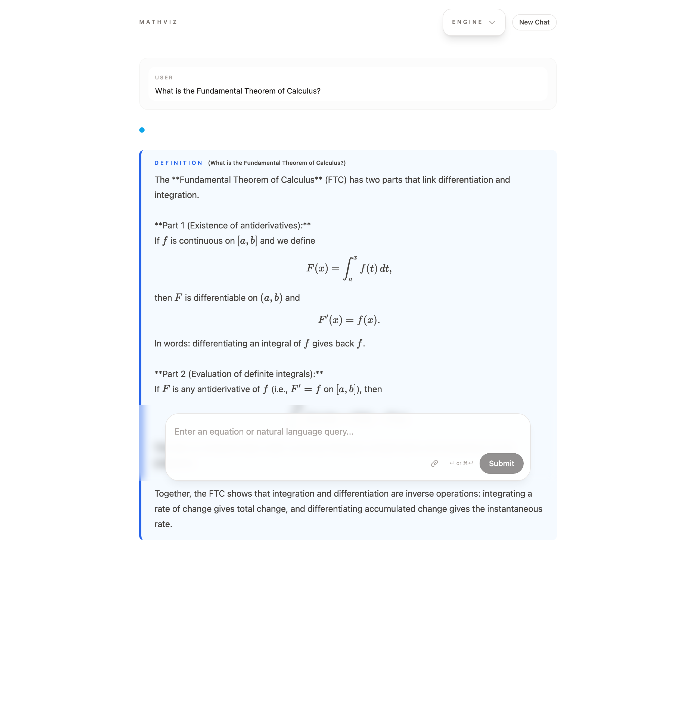
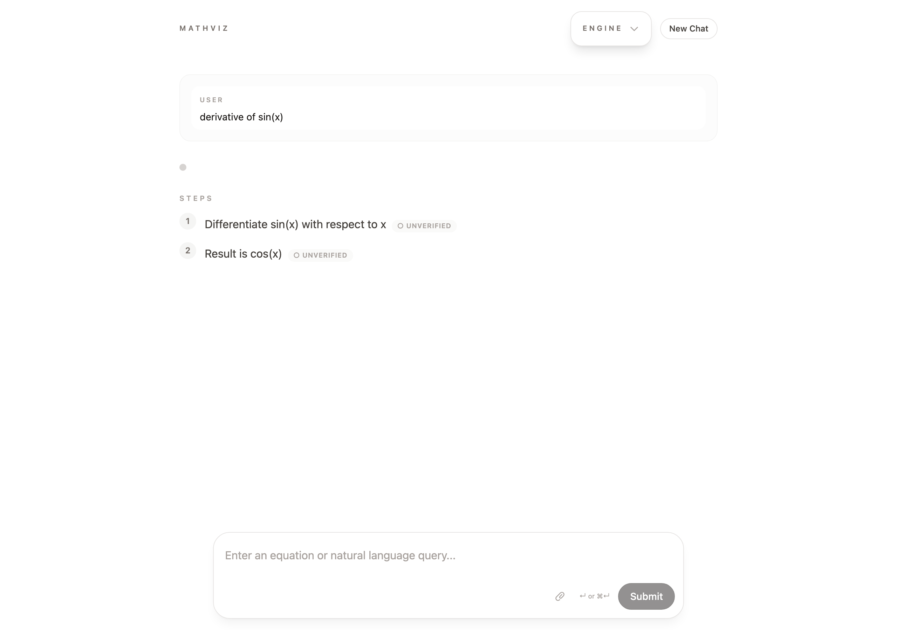
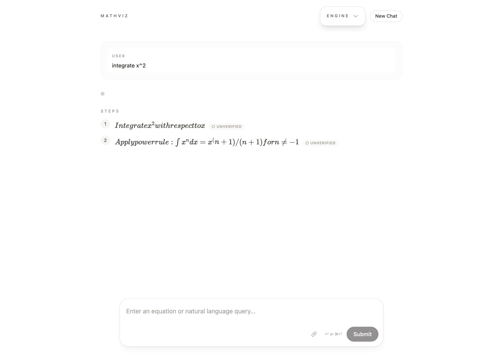
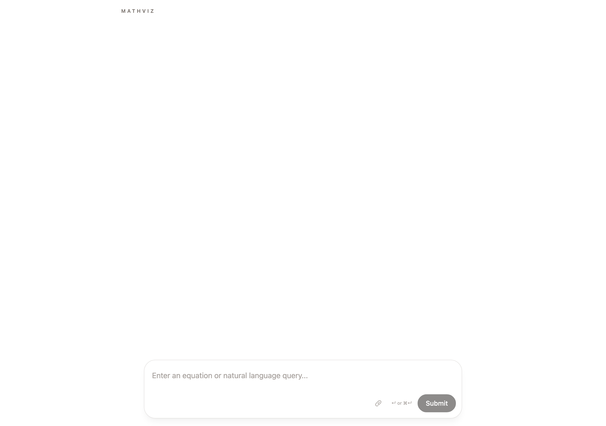

<p align="center">
  <br />
  <br />
  <code>&nbsp;M A T H V I Z&nbsp;</code>
  <br />
  <br />
  <em>Verified-first math orchestration</em>
  <br />
  <br />
  <a href="#quick-start"></a>
  <a href="#tech-stack"></a>
  <a href="#tech-stack"></a>
  <a href="LICENSE"></a>
</p>

<br />

<p align="center">
  
</p>

<br />

## What is this?

MathViz is a conversational math solver that handles any advanced engineering mathematics problem — from Kreyszig-level probability to Fourier series — with **every intermediate step verified by SymPy**. Ask in natural language, get textbook-quality output with proofs you can trust.

<br />

## Features

**Solve** &mdash; natural language &rarr; symbolic computation pipeline
- Any query dynamically routed through NLP (NVIDIA NIM / Anthropic Claude)
- SymPy verification on every intermediate step &mdash; green badges show `VERIFIED`
- Step-by-step reasoning with numbered walkthrough

**Render** &mdash; textbook-quality math, not plain text
- KaTeX for all equations (inline `$...$` and display `$$...$$`)
- TheoremBox components styled like LaTeX `amsthm` environments
- Interactive Desmos and GeoGebra graphs

**Stream** &mdash; real-time gate-by-gate progress
- 6-stage Zod-validated pipeline: Input &rarr; Routing &rarr; SymPy &rarr; Symbol &rarr; Verify &rarr; Graph
- Live progress indicator as each gate completes
- Engine diagnostics panel with per-gate timing

**Upload** &mdash; scan textbook problems
- Paperclip icon to attach images (JPG, PNG, WebP)
- Vision-capable AI extracts the math problem from photos

<br />

## Architecture

```
                    ┌──────────────┐
                    │  CommandBar  │   natural language + image upload
                    └──────┬───────┘
                           │
                    ┌──────▼───────┐
                    │  NLP Router  │   NIM / Anthropic / Stub
                    └──────┬───────┘
                           │
              ┌────────────┼────────────┐
              │            │            │
        ┌─────▼─────┐ ┌───▼────┐ ┌─────▼─────┐
        │  SymPy    │ │ Verify │ │  Graph    │
        │  Sidecar  │ │ Steps  │ │  Builder  │
        │  (8100)   │ │        │ │           │
        └─────┬─────┘ └───┬────┘ └─────┬─────┘
              │            │            │
              └────────────┼────────────┘
                           │
                    ┌──────▼───────┐
                    │  Renderer    │   KaTeX + Desmos + GeoGebra
                    └──────────────┘
```

<br />

## Quick Start

**Prerequisites:** Node.js 20, Yarn, Python 3.10+

```bash
# Clone
git clone https://github.com/stussysenik/math-explainer-redwood.git
cd math-explainer-redwood

# Install JS dependencies
yarn install

# Set up the database
yarn rw prisma migrate dev

# Set up the Python sidecar
cd sidecar
python3 -m venv .venv && source .venv/bin/activate
pip install -r requirements.txt
cd ..

# Configure environment
cp .env.example .env
# Add your API keys to .env:
#   NVIDIA_NIM_API_KEY=...
#   ANTHROPIC_API_KEY=...
#   DESMOS_API_KEY=...

# Run everything (sidecar + Redwood dev server)
./scripts/dev.sh
```

Open [localhost:8920](http://localhost:8920) and start solving.

<br />

## Screenshots

<table>
  <tr>
    <td align="center" width="50%">
      
      <br />
      <sub><b>Computation</b> &mdash; step-by-step with verification</sub>
    </td>
    <td align="center" width="50%">
      
      <br />
      <sub><b>Theory</b> &mdash; KaTeX-rendered definitions</sub>
    </td>
  </tr>
  <tr>
    <td align="center" width="50%">
      
      <br />
      <sub><b>Integration</b> &mdash; symbolic result + graph</sub>
    </td>
    <td align="center" width="50%">
      
      <br />
      <sub><b>Landing</b> &mdash; minimal, focused input</sub>
    </td>
  </tr>
</table>

<br />

## Tech Stack

| Layer | Technology | Role |
|-------|-----------|------|
| Framework | [RedwoodJS](https://redwoodjs.com) 8.9 | Full-stack React + GraphQL + Prisma |
| Frontend | React 18 + Tailwind CSS 3 | Component rendering |
| Math | [KaTeX](https://katex.org) | LaTeX equation rendering |
| Graphs | [Desmos API](https://www.desmos.com/api) + [GeoGebra](https://www.geogebra.org) | Interactive graphing |
| NLP | NVIDIA NIM / Anthropic Claude | Natural language understanding |
| Symbolic | [SymPy](https://www.sympy.org) (Python FastAPI sidecar) | Computation + verification |
| Database | SQLite + Prisma ORM | Conversation persistence |
| Validation | [Zod](https://zod.dev) | Gate-by-gate schema validation |

<br />

## Project Structure

```
math-explainer-redwood/
├── api/                    # GraphQL API + pipeline
│   ├── src/lib/pipeline/   # 6-gate orchestrator (Zod-validated)
│   ├── src/lib/nlpRouter/  # NIM, Anthropic, Stub adapters
│   ├── src/lib/engines/    # SymPy client
│   └── src/services/       # Solve mutation + streaming
├── web/                    # React frontend
│   ├── src/components/
│   │   ├── math/           # KaTeXBlock, MathText, DesmosGraph, GeoGebraGraph
│   │   └── solve/          # CommandBar, StepByStep, TheoremBox, GateProgress
│   └── src/hooks/          # useSolveStream, useExternalScript
├── sidecar/                # Python FastAPI (port 8100)
│   └── math_sidecar/
│       ├── routers/        # SymPy, Wolfram, Octave endpoints
│       └── services/       # DSPy router, clients
└── scripts/
    └── dev.sh              # One-command dev startup
```

<br />

## License

[MIT](LICENSE)

<br />

<p align="center">
  <sub>Built with <a href="https://redwoodjs.com">RedwoodJS</a> and <a href="https://www.sympy.org">SymPy</a></sub>
</p>
